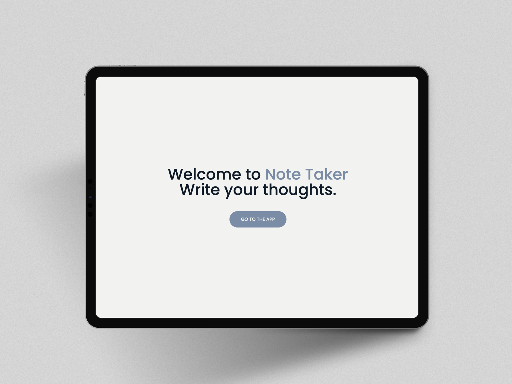
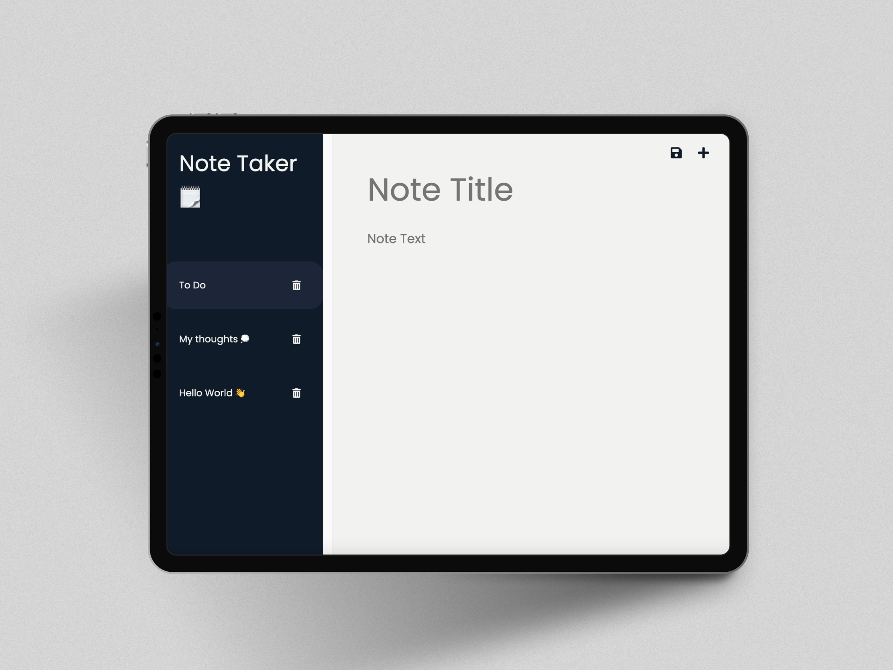

# 🗒 Note Taker
Minimalist app for take simple notes, with a great design, Note taker would help you to type down your ideas and everything that you need remember.

## 🛠 Tools

- HTML
- CSS
- JavaScript
- Fonts Awesome (CDN)
- Google Fonts (CDN)
- Tippy JS (CDN)
- Express JS
- Sass
- Nodemon


## 🚀 Deployment
https://johanh0.github.io/Cherry-Email/
## 📸 Screen Shots
 

## 💻 Installation

To install dependencies follow this commands on the root file.

```
npm install -y
```

```
npm i express node-sass 
```

```
npm i -D nodemon
```

### Express
Express help us with the server, with it we can create the server, the routes and work with the API

### Node-sass
Node-sass it's the library for use Sass instead of use CSS for type the styles, if you want to edit the style of the project
you have to run the next command and edit from the Sass file.

```
npm run sass
```

### Nodemon
Nodemon help us to restart the server automatically, so we don't have to be killing and running the server multiple times
if you want to run the nodemon you have to use the next command.

```
npx nodemon server.js
```
## 👏 Gratitude
Thanks to [@cssbuttons.io](https://github.com/cssbuttons-io)
She/He or They created the button animation on the home page.

## Support or contact

For support or if you wish contact me please, email me to [johanherrera20000@gmail.com](mailto:johanherrera20000@gmail.com).

## Author

- [@Johanh0](https://www.github.com/johanh0)